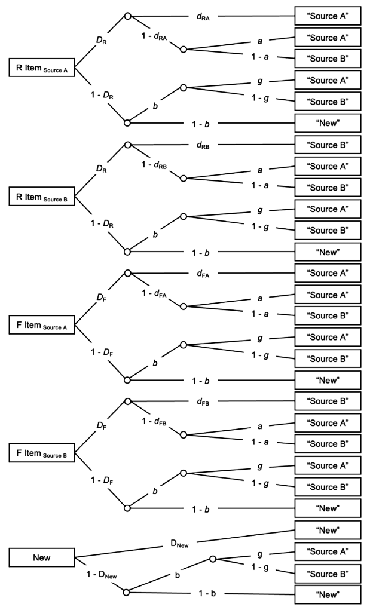
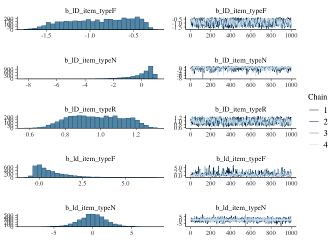
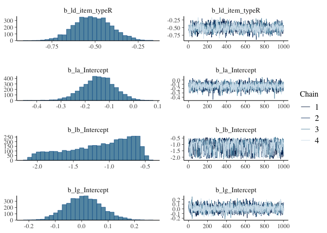
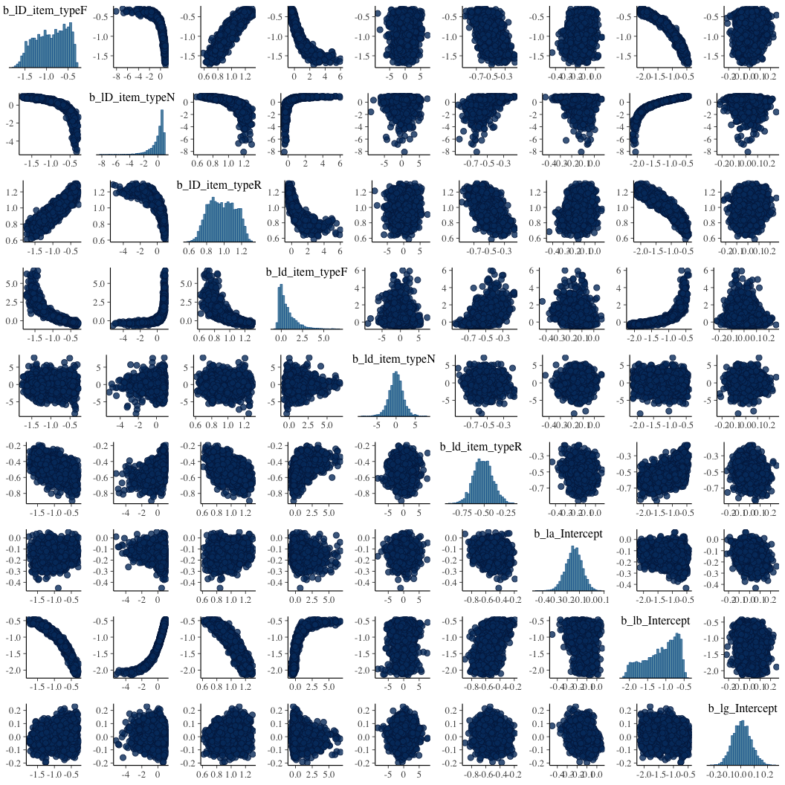
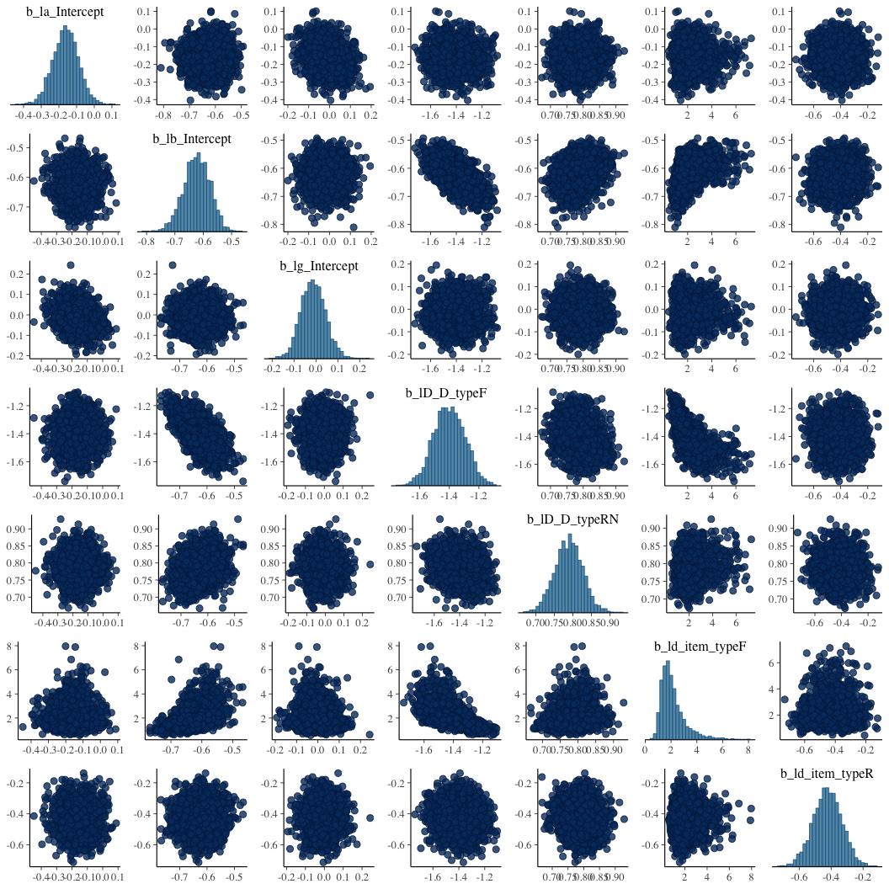

::: {.cell}

```{.r .cell-code}
library(readr)
library(dplyr)
library(tidyr)
library(knitr)
library(MPTinR)
library(brms)
library(bmm)
library(cmdstanr)
library(rstan)
```
:::


Get the number of observations per condition and response type for the source


::: {.cell}

```{.r .cell-code}
events_file <- "data/E3_events.csv"

if (!file.exists(events_file)) {
  source("R/export_aggregate_events.r")
  read_csv("data/E3_data.csv") |> 
    aggregate_event_counts() |> 
    write_csv(events_file)
} 

data <- read_csv(events_file)
```
:::


It is in long format:


::: {.cell}

```{.r .cell-code}
head(data, n = 20) |> kable()
```

::: {.cell-output-display}


|  id|item_type  |source |resp |  n|
|---:|:----------|:------|:----|--:|
| 101|distractor |N      |A    |  1|
| 101|distractor |N      |B    |  0|
| 101|distractor |N      |N    | 79|
| 101|F item     |A      |A    |  1|
| 101|F item     |A      |B    |  2|
| 101|F item     |A      |N    | 17|
| 101|F item     |B      |A    |  1|
| 101|F item     |B      |B    |  4|
| 101|F item     |B      |N    | 15|
| 101|R item     |A      |A    |  6|
| 101|R item     |A      |B    |  2|
| 101|R item     |A      |N    | 12|
| 101|R item     |B      |A    |  4|
| 101|R item     |B      |B    |  4|
| 101|R item     |B      |N    | 12|
| 102|distractor |N      |A    | 18|
| 102|distractor |N      |B    | 13|
| 102|distractor |N      |N    | 49|
| 102|F item     |A      |A    |  8|
| 102|F item     |A      |B    |  5|


:::
:::


## Fit authors' MPT model with MPTinR

The full model in the paper is: (figure from the paper):



which we can express as


::: {.cell}

```{.r .cell-code}
full_model <- "
# Responses to R Items from Source A (order: Source A, Source B and New)
D_R * (1-d_RA) * a + (1-D_R) * b * g + D_R * d_RA
D_R * (1-d_RA) * (1-a) + (1-D_R) * b * (1-g)
(1-D_R) * (1-b)

# Responses to R Items from Source B (order: Source A, Source B and New)
D_R * (1-d_RB) * a + (1-D_R) * b * g
D_R * (1-d_RB) * (1-a) + (1-D_R) * b * (1-g) + D_R * d_RB
(1-D_R) * (1-b)

# Responses to F Items from Source A (order: Source A, Source B and New)
D_F * (1-d_FA) * a + (1-D_F) * b * g + D_F * d_FA
D_F * (1-d_FA) * (1-a) + (1-D_F) * b * (1-g)
(1-D_F) * (1-b)

# Responses to F Items from Source B (order: Source A, Source B and New)
D_F * (1-d_FB) * a + (1-D_F) * b * g
D_F * (1-d_FB) * (1-a) + (1-D_F) * b * (1-g) + D_F * d_FB
(1-D_F) * (1-b)

# Responses to New Items (order: Source A, Source B and New)
(1-D_N) * b * g
(1-D_N) * b * (1-g)
(1-D_N) * (1-b) + D_N
"
```
:::


Check that the model specification doesn't violate any assumptions:


::: {.cell}

```{.r .cell-code}
check.mpt(textConnection(full_model))
```

::: {.cell-output .cell-output-stdout}

```
$probabilities.eq.1
[1] TRUE

$n.trees
[1] 5

$n.model.categories
[1] 15

$n.independent.categories
[1] 10

$n.params
[1] 10

$parameters
 [1] "a"    "b"    "D_F"  "d_FA" "d_FB" "D_N"  "D_R"  "d_RA" "d_RB" "g"   
```


:::
:::


They restricted some parameters: 

"We set $d_{RA}$ = $d_{RB}$ (labeled as $d_R$), $d_{FA}$ = $d_{FB}$ (labeled as $d_{F}$), and $D_{new}$ = $D_{R}$"

which we can specify as a string as well:


::: {.cell}

```{.r .cell-code}
mpt_restrictions <- "
d_RA = d_RB
d_FA = d_FB
D_R = D_N
"
```
:::


For MPTinR we need the data to be a matrix where each row is an entire dataset (e.g. participant), and the columns represent the number of responses for each condition by response combination. The order needs to match the order of the model components listed above. We'll need to do some data magic. First ensure correct ordering:


::: {.cell}

```{.r .cell-code}
data <- data |> 
  mutate(item_type = case_when(
    item_type == "R item" ~ "R",
    item_type == "F item" ~ "F",
    item_type == "distractor" ~ "D"
  )) |> 
  arrange(id, desc(item_type), source, resp)
data[data$item_type == "D",]$item_type <- "N"
head(data, 15)
```

::: {.cell-output .cell-output-stdout}

```
# A tibble: 15 × 5
      id item_type source resp      n
   <dbl> <chr>     <chr>  <chr> <dbl>
 1   101 R         A      A         6
 2   101 R         A      B         2
 3   101 R         A      N        12
 4   101 R         B      A         4
 5   101 R         B      B         4
 6   101 R         B      N        12
 7   101 F         A      A         1
 8   101 F         A      B         2
 9   101 F         A      N        17
10   101 F         B      A         1
11   101 F         B      B         4
12   101 F         B      N        15
13   101 N         N      A         1
14   101 N         N      B         0
15   101 N         N      N        79
```


:::
:::


then pivot to wide and change to matrix:


::: {.cell}

```{.r .cell-code}
data_mat <- data |> 
  pivot_wider(names_from = c("item_type", "source", "resp"), values_from = "n") |> 
  select(-id) |> 
  as.matrix()
str(data_mat)
```

::: {.cell-output .cell-output-stdout}

```
 num [1:81, 1:15] 6 7 8 9 11 11 8 13 15 13 ...
 - attr(*, "dimnames")=List of 2
  ..$ : NULL
  ..$ : chr [1:15] "R_A_A" "R_A_B" "R_A_N" "R_B_A" ...
```


:::

```{.r .cell-code}
colnames(data_mat)
```

::: {.cell-output .cell-output-stdout}

```
 [1] "R_A_A" "R_A_B" "R_A_N" "R_B_A" "R_B_B" "R_B_N" "F_A_A" "F_A_B" "F_A_N"
[10] "F_B_A" "F_B_B" "F_B_N" "N_N_A" "N_N_B" "N_N_N"
```


:::
:::


and now we can finally estimate the model with MPTinR:


::: {.cell}

```{.r .cell-code}
mpt_fit <- fit.mpt(
  data = data_mat, 
  model.filename = textConnection(full_model), 
  restrictions.filename = textConnection(mpt_restrictions)
)
#> Presenting the best result out of 5 minimization runs.
#> [1] "Model fitting begins at 2025-02-05 14:32:56.923641"
#> Optimization routine for dataset(s) 1 5 6 7 8 10 15 17 32 40 43 46 47 51 55 59 61 62 67 70 72 76 78 81
#>   did not converge succesfully. Tried again with use.gradient == FALSE.
#> Optimization for dataset(s) 1 5 6 7 8 10 15 17 32 40 43 47 55 59 61 67 70 76 78 81
#>   using numerically estimated gradients produced better results. Using those results.
#>   Old results saved in output == 'full' [['optim.runs']].
#> Optimization for dataset(s) 46 51 62 72
#>   using numerical estimated gradients did NOT produce better results.
#>   Keeping original results. Use output = 'full' for more details.
#> Warning in fit.mptinr(data = data, objective = llk.model, param.names = param.names, : Error code(s) in final results: 0 1. The following dataset(s) did not converge succesfully in the best fitting optimization run:
#> 46 51 62 72
#> [1] "Model fitting stopped at 2025-02-05 14:33:02.282152"
#> Time difference of 5.358511 secs
```
:::


We get lots of convergence warnings for the individual subjects. Not surprising since many participants lack observations in some cells. 

The authors of the paper only fitted the model on the aggregated data. `fit.mpt` automatically fits both the individual subjects and the aggregated data, so we can check out the aggregate fits. First, some info statistics:


::: {.cell}

```{.r .cell-code}
mpt_fit$goodness.of.fit$aggregated
```

::: {.cell-output .cell-output-stdout}

```
  Log.Likelihood G.Squared df   p.value
1      -9204.965   1.28054  3 0.7337593
```


:::

```{.r .cell-code}
mpt_fit$information.criteria$aggregated
```

::: {.cell-output .cell-output-stdout}

```
       AIC     BIC
1 15.28054 67.5679
```


:::

```{.r .cell-code}
mpt_fit$model.info$aggregated
```

::: {.cell-output .cell-output-stdout}

```
  rank.fisher n.parameters n.independent.categories
1           7            7                       10
```


:::
:::


And the parameter estimates:


::: {.cell}

```{.r .cell-code}
agg_est <- mpt_fit$parameters$aggregated
par_order <- c("a", "b", "g", "D_R", "D_F", "d_RA", "d_FA")
idx <- match(par_order, rownames(agg_est))
print(agg_est[idx,], digits = 3)
```

::: {.cell-output .cell-output-stdout}

```
     estimates lower.conf upper.conf restricted.parameter
a        0.460      0.425      0.496                     
b        0.350      0.328      0.372                     
g        0.497      0.469      0.524                     
D_R      0.688      0.672      0.704                  D_N
D_F      0.197      0.159      0.235                     
d_RA     0.395      0.353      0.437                 d_RB
d_FA     0.879      0.692      1.066                 d_FB
```


:::
:::


Thankfully that matches exactly the results from the paper, so I know I didn't mess up anything in the data transformation.

## Fit authors' MPT model with BRMS: Attemp 1

As I documented in a [GitHub issue](https://github.com/venpopov/bmm/issues/255) for `bmm`, it is possible to estimate MPT models in brms with a multinomial family and some clever hacks of the brms formula syntax. In the linked issue, I did it only for a simple two-high-threshold model of an old/new recognition task. Let's see if I can find a way to use the same approach here.

For the brms approach, we need the data in long-format, but with each response-type in a separate column. 


::: {.cell}

```{.r .cell-code}
(data_brms <- data |> 
  pivot_wider(names_from = c("resp"), values_from = c("n")) |> 
  mutate(total = A + B + N))
```

::: {.cell-output .cell-output-stdout}

```
# A tibble: 405 × 7
      id item_type source     A     B     N total
   <dbl> <chr>     <chr>  <dbl> <dbl> <dbl> <dbl>
 1   101 R         A          6     2    12    20
 2   101 R         B          4     4    12    20
 3   101 F         A          1     2    17    20
 4   101 F         B          1     4    15    20
 5   101 N         N          1     0    79    80
 6   102 R         A          7     4     9    20
 7   102 R         B          6     8     6    20
 8   102 F         A          8     5     7    20
 9   102 F         B          8     8     4    20
10   102 N         N         18    13    49    80
# ℹ 395 more rows
```


:::
:::


We need dummy variables for each of the five trees:


::: {.cell}

```{.r .cell-code}
(data_brms <- data_brms |> 
  mutate(
    tree1 = as.numeric(item_type == "R" & source == "A"),
    tree2 = as.numeric(item_type == "R" & source == "B"),
    tree3 = as.numeric(item_type == "F" & source == "A"),
    tree4 = as.numeric(item_type == "F" & source == "B"),
    tree5 = as.numeric(item_type == "N")
  ))
```

::: {.cell-output .cell-output-stdout}

```
# A tibble: 405 × 12
      id item_type source     A     B     N total tree1 tree2 tree3 tree4 tree5
   <dbl> <chr>     <chr>  <dbl> <dbl> <dbl> <dbl> <dbl> <dbl> <dbl> <dbl> <dbl>
 1   101 R         A          6     2    12    20     1     0     0     0     0
 2   101 R         B          4     4    12    20     0     1     0     0     0
 3   101 F         A          1     2    17    20     0     0     1     0     0
 4   101 F         B          1     4    15    20     0     0     0     1     0
 5   101 N         N          1     0    79    80     0     0     0     0     1
 6   102 R         A          7     4     9    20     1     0     0     0     0
 7   102 R         B          6     8     6    20     0     1     0     0     0
 8   102 F         A          8     5     7    20     0     0     1     0     0
 9   102 F         B          8     8     4    20     0     0     0     1     0
10   102 N         N         18    13    49    80     0     0     0     0     1
# ℹ 395 more rows
```


:::
:::


With the help of the dummy variables we can construct one formula for each of the three response types. We use these dummy variables to "turn on/off" different parts of the formula.

There are many different ways to construct the formulas. In this one we skip the parameter indices, and we will let parameters vary by condition. When we do that we observe a lot of duplication we could reduce, but let's keep it explicit for now.


::: {.cell}

```{.r .cell-code}
# package the responses as a matrix
data_brms$y <- with(data_brms, cbind(A, B, N))
mpt_base_formula <- bf(y | trials(total) ~ 1, nl = TRUE)
mpt_mus_formulas <- list(
  nlf(
    muA ~ log(
      tree1 * (D*(1-d)*a + (1-D)*b*g + D*d) + 
      tree2 * (D*(1-d)*a + (1-D)*b*g) + 
      tree3 * (D*(1-d)*a + (1-D)*b*g + D*d) + 
      tree4 * (D*(1-d)*a + (1-D)*b*g) + 
      tree5 * ((1-D)*b*g)
    )
  ),
  nlf(
    muB ~ log(
      tree1 * (D*(1-d)*(1-a) + (1-D)*b*(1-g)) +
      tree2 * (D*(1-d)*(1-a) + (1-D)*b*(1-g) + D*d) +
      tree3 * (D*(1-d)*(1-a) + (1-D)*b*(1-g)) +
      tree4 * (D*(1-d)*(1-a) + (1-D)*b*(1-g) + D*d) +
      tree5 * ((1-D)*b*(1-g))
    )
  ),
  nlf(
    muN ~ log(
      tree1 * ((1-D)*(1-b)) +
      tree2 * ((1-D)*(1-b)) +
      tree3 * ((1-D)*(1-b)) +
      tree4 * ((1-D)*(1-b)) +
      tree5 * ((1-D)*(1-b) + D)
    )
  )
) 
```
:::


We wrap each formula in log(), because the multinomial family applies a softmax transformation. The parameters should also be sample on a logit scale, so we need to add some transformations:


::: {.cell}

```{.r .cell-code}
mpt_par_formulas <- list(
  nlf(D ~ inv_logit(lD)),
  nlf(d ~ inv_logit(ld)),
  nlf(a ~ inv_logit(la)),
  nlf(b ~ inv_logit(lb)),
  nlf(g ~ inv_logit(lg))
)
```
:::


and finally our actual predictor formulas. We let D vary by item_type (although the source made D_R == D_N, we can't do it with this coding - will do later). First, ignore random effects for a sanity check:


::: {.cell}

```{.r .cell-code}
mpt_pred_formulas <- list(
  lf(lD ~ 0 + item_type),
  lf(ld ~ 0 + item_type),
  lf(la ~ 1),
  lf(lb ~ 1),
  lf(lg ~ 1)
)
```
:::


I immediately notice a problem. We want ld to vary by item_type, but that parameter doesn't matter for new items, so sampling it will not influence the likelihood. That might cause sampling problems. One solution is to try to fix it via a prior. Tricky... the other is to make the parameters again explicit. Let's see how it goes as it is.

We combine all the formulas together:


::: {.cell}

```{.r .cell-code}
(mpt_form1 <- Reduce(`+`, c(mpt_mus_formulas, mpt_par_formulas, mpt_pred_formulas), init = mpt_base_formula))
```

::: {.cell-output .cell-output-stdout}

```
y | trials(total) ~ 1 
muA ~ log(tree1 * (D * (1 - d) * a + (1 - D) * b * g + D * d) + tree2 * (D * (1 - d) * a + (1 - D) * b * g) + tree3 * (D * (1 - d) * a + (1 - D) * b * g + D * d) + tree4 * (D * (1 - d) * a + (1 - D) * b * g) + tree5 * ((1 - D) * b * g))
muB ~ log(tree1 * (D * (1 - d) * (1 - a) + (1 - D) * b * (1 - g)) + tree2 * (D * (1 - d) * (1 - a) + (1 - D) * b * (1 - g) + D * d) + tree3 * (D * (1 - d) * (1 - a) + (1 - D) * b * (1 - g)) + tree4 * (D * (1 - d) * (1 - a) + (1 - D) * b * (1 - g) + D * d) + tree5 * ((1 - D) * b * (1 - g)))
muN ~ log(tree1 * ((1 - D) * (1 - b)) + tree2 * ((1 - D) * (1 - b)) + tree3 * ((1 - D) * (1 - b)) + tree4 * ((1 - D) * (1 - b)) + tree5 * ((1 - D) * (1 - b) + D))
D ~ inv_logit(lD)
d ~ inv_logit(ld)
a ~ inv_logit(la)
b ~ inv_logit(lb)
g ~ inv_logit(lg)
lD ~ 0 + item_type
ld ~ 0 + item_type
la ~ 1
lb ~ 1
lg ~ 1
```


:::
:::


We put logistic priors on all the relevant parameters (uniform on the probability scale):


::: {.cell}

```{.r .cell-code}
mpt_prior1 <- 
  prior("logistic(0, 1)", nlpar = "lD", class = "b") +
  prior("logistic(0, 1)", nlpar = "ld", class = "b") +
  prior("logistic(0, 1)", nlpar = "la", class = "b") +
  prior("logistic(0, 1)", nlpar = "lb", class = "b") +
  prior("logistic(0, 1)", nlpar = "lg", class = "b")
```
:::


and now we are ready to try fitting this:


::: {.cell}

```{.r .cell-code}
fit_mpt_brm1 <- brm(
  mpt_form1, 
  data = data_brms, 
  family = multinomial(refcat = NA),
  prior = mpt_prior1,
  refresh = 2000
)
```

::: {.cell-output .cell-output-stderr}

```
Start sampling
```


:::

::: {.cell-output .cell-output-stdout}

```
Running MCMC with 4 parallel chains...

Chain 1 Iteration:    1 / 2000 [  0%]  (Warmup) 
Chain 2 Iteration:    1 / 2000 [  0%]  (Warmup) 
Chain 3 Iteration:    1 / 2000 [  0%]  (Warmup) 
Chain 4 Iteration:    1 / 2000 [  0%]  (Warmup) 
Chain 3 Iteration: 1001 / 2000 [ 50%]  (Sampling) 
Chain 4 Iteration: 1001 / 2000 [ 50%]  (Sampling) 
Chain 1 Iteration: 1001 / 2000 [ 50%]  (Sampling) 
Chain 2 Iteration: 1001 / 2000 [ 50%]  (Sampling) 
Chain 4 Iteration: 2000 / 2000 [100%]  (Sampling) 
Chain 4 finished in 57.6 seconds.
Chain 2 Iteration: 2000 / 2000 [100%]  (Sampling) 
Chain 2 finished in 60.5 seconds.
Chain 1 Iteration: 2000 / 2000 [100%]  (Sampling) 
Chain 1 finished in 62.1 seconds.
Chain 3 Iteration: 2000 / 2000 [100%]  (Sampling) 
Chain 3 finished in 63.3 seconds.

All 4 chains finished successfully.
Mean chain execution time: 60.9 seconds.
Total execution time: 63.4 seconds.
```


:::
:::


No scary convergence messages, though Rhat is marginal (should increase samples):


::: {.cell}

```{.r .cell-code}
summary(fit_mpt_brm1)
```

::: {.cell-output .cell-output-stdout}

```
 Family: multinomial 
  Links: muA = logit; muB = logit; muN = logit 
Formula: y | trials(total) ~ 1 
         muA ~ log(tree1 * (D * (1 - d) * a + (1 - D) * b * g + D * d) + tree2 * (D * (1 - d) * a + (1 - D) * b * g) + tree3 * (D * (1 - d) * a + (1 - D) * b * g + D * d) + tree4 * (D * (1 - d) * a + (1 - D) * b * g) + tree5 * ((1 - D) * b * g))
         muB ~ log(tree1 * (D * (1 - d) * (1 - a) + (1 - D) * b * (1 - g)) + tree2 * (D * (1 - d) * (1 - a) + (1 - D) * b * (1 - g) + D * d) + tree3 * (D * (1 - d) * (1 - a) + (1 - D) * b * (1 - g)) + tree4 * (D * (1 - d) * (1 - a) + (1 - D) * b * (1 - g) + D * d) + tree5 * ((1 - D) * b * (1 - g)))
         muN ~ log(tree1 * ((1 - D) * (1 - b)) + tree2 * ((1 - D) * (1 - b)) + tree3 * ((1 - D) * (1 - b)) + tree4 * ((1 - D) * (1 - b)) + tree5 * ((1 - D) * (1 - b) + D))
         D ~ inv_logit(lD)
         d ~ inv_logit(ld)
         a ~ inv_logit(la)
         b ~ inv_logit(lb)
         g ~ inv_logit(lg)
         lD ~ 0 + item_type
         ld ~ 0 + item_type
         la ~ 1
         lb ~ 1
         lg ~ 1
   Data: data_brms (Number of observations: 405) 
  Draws: 4 chains, each with iter = 2000; warmup = 1000; thin = 1;
         total post-warmup draws = 4000

Regression Coefficients:
              Estimate Est.Error l-95% CI u-95% CI Rhat Bulk_ESS Tail_ESS
lD_item_typeF    -0.90      0.36    -1.55    -0.36 1.00      614     1220
lD_item_typeN    -0.01      0.98    -2.72     0.88 1.00      601     1295
lD_item_typeR     0.98      0.15     0.72     1.24 1.00      642     1923
ld_item_typeF     0.67      1.03    -0.38     3.46 1.01      637      960
ld_item_typeN    -0.00      1.81    -3.68     3.57 1.00     3085     1772
ld_item_typeR    -0.51      0.11    -0.72    -0.30 1.00     1091     1933
la_Intercept     -0.15      0.07    -0.28    -0.02 1.00     2359     2581
lb_Intercept     -1.13      0.44    -2.02    -0.54 1.00      592     1252
lg_Intercept      0.01      0.07    -0.12     0.15 1.00     2610     2755

Draws were sampled using sample(hmc). For each parameter, Bulk_ESS
and Tail_ESS are effective sample size measures, and Rhat is the potential
scale reduction factor on split chains (at convergence, Rhat = 1).
```


:::
:::


Already can notice teh huge range for ld_item_typeN, which makes sense because as I noted that condition does not have an effect on the likelihood. Let's turn into proportion scale to compare with original model:


::: {.cell}

```{.r .cell-code}
inv_logit <- function(x) 1/(1+exp(-x))
fit_mpt_brm1 |> 
  as_draws_array(variable = "b_l._", regex = TRUE) |> 
  inv_logit() |> 
  summary() |> 
  mutate(variable = gsub("(^b_l|_Intercept|D_type|item_type)", "", variable)) |> 
  filter(variable != "d_N")
```

::: {.cell-output .cell-output-stdout}

```
# A tibble: 8 × 10
  variable  mean median     sd    mad    q5   q95  rhat ess_bulk ess_tail
  <chr>    <dbl>  <dbl>  <dbl>  <dbl> <dbl> <dbl> <dbl>    <dbl>    <dbl>
1 D_F      0.294  0.294 0.0714 0.0912 0.184 0.403  1.00     614.    1220.
2 D_N      0.515  0.579 0.181  0.141  0.118 0.700  1.00     601.    1295.
3 D_R      0.726  0.726 0.0295 0.0351 0.678 0.771  1.00     642.    1923.
4 d_F      0.624  0.587 0.164  0.174  0.420 0.934  1.01     637.     960.
5 d_R      0.375  0.374 0.0251 0.0251 0.334 0.418  1.00    1091.    1933.
6 a        0.464  0.464 0.0164 0.0160 0.436 0.490  1.00    2359.    2581.
7 b        0.252  0.259 0.0763 0.0947 0.124 0.361  1.00     592.    1252.
8 g        0.502  0.502 0.0168 0.0170 0.475 0.530  1.00    2610.    2755.
```


:::
:::


a, b and g are *roughly* the same as the non-brms model. The others are not so much. D_F = 0.294, D_N = 0.521, D_R = 0.725. In the original model D_R was constrained to be the same as D_N, which here it's clearly not. But is that a problem with the brms model or would it also appear if we did not constrain D_R = D_N in the non-brms model? I'll come back to this. Let's look at some plots:


::: {.cell}

```{.r .cell-code}
plot(fit_mpt_brm1, ask = FALSE)
```

::: {.cell-output-display}

:::

::: {.cell-output-display}

:::
:::


Some strange posterior distributions. How about the pairs plot?


::: {.cell}

```{.r .cell-code}
pairs(fit_mpt_brm1)
```

::: {.cell-output-display}

:::
:::


alright that looks bad! Clear screaming issues with identifiability. 

As a curiousity, how does the non-bayesian model fare if we relax the D_N = D_R constraint:


::: {.cell}

```{.r .cell-code}
mpt_fit2 <- fit.mpt(
  data = colSums(data_mat), 
  model.filename = textConnection(full_model), 
  restrictions.filename = textConnection("d_RA = d_RB\nd_FA = d_FB")
)
```

::: {.cell-output .cell-output-stderr}

```
Presenting the best result out of 5 minimization runs.
```


:::

::: {.cell-output .cell-output-stdout}

```
[1] "Model fitting begins at 2025-02-05 14:43:32.571594"
[1] "Model fitting stopped at 2025-02-05 14:43:32.707062"
Time difference of 0.135468 secs
```


:::

```{.r .cell-code}
mpt_fit2$goodness.of.fit
```

::: {.cell-output .cell-output-stdout}

```
  Log.Likelihood G.Squared df   p.value
1      -9204.854  1.057623  2 0.5893049
```


:::

```{.r .cell-code}
print(mpt_fit2$parameters, digits = 3)
```

::: {.cell-output .cell-output-stdout}

```
     estimates lower.conf upper.conf restricted.parameter
a        0.463   0.425665      0.500                     
b        0.266  -0.113538      0.645                     
D_F      0.289  -0.078381      0.656                     
d_FA     0.600  -0.163741      1.363                 d_FB
d_FB     0.600  -0.163741      1.363                     
D_N      0.588   0.000311      1.177                     
D_R      0.724   0.580114      0.868                     
d_RA     0.376   0.291093      0.460                 d_RB
d_RB     0.376   0.291093      0.460                     
g        0.503   0.465995      0.540                     
```


:::
:::


Very similar actually in parameter estimates. But we get no warnings or ways to identify problems with parameter identifiability or tradeoffs. 

## Fit authors' MPT model with BRMS: Attemp 2

Small change first. Fix the ld_item_typeN parameter to be a constant 0


::: {.cell}

```{.r .cell-code}
mpt_prior2 <- mpt_prior1 +
  prior("constant(0)", nlpar = "ld", class = "b", coef = "item_typeN")
fit_mpt_brm2 <- brm(
  mpt_form1, 
  data = data_brms, 
  family = multinomial(refcat = NA),
  prior = mpt_prior2,
  refresh = 2000
)
```

::: {.cell-output .cell-output-stderr}

```
Start sampling
```


:::

::: {.cell-output .cell-output-stdout}

```
Running MCMC with 4 parallel chains...

Chain 1 Iteration:    1 / 2000 [  0%]  (Warmup) 
Chain 2 Iteration:    1 / 2000 [  0%]  (Warmup) 
Chain 3 Iteration:    1 / 2000 [  0%]  (Warmup) 
Chain 4 Iteration:    1 / 2000 [  0%]  (Warmup) 
Chain 3 Iteration: 1001 / 2000 [ 50%]  (Sampling) 
Chain 1 Iteration: 1001 / 2000 [ 50%]  (Sampling) 
Chain 4 Iteration: 1001 / 2000 [ 50%]  (Sampling) 
Chain 2 Iteration: 1001 / 2000 [ 50%]  (Sampling) 
Chain 1 Iteration: 2000 / 2000 [100%]  (Sampling) 
Chain 1 finished in 52.0 seconds.
Chain 3 Iteration: 2000 / 2000 [100%]  (Sampling) 
Chain 3 finished in 54.4 seconds.
Chain 2 Iteration: 2000 / 2000 [100%]  (Sampling) 
Chain 2 finished in 60.5 seconds.
Chain 4 Iteration: 2000 / 2000 [100%]  (Sampling) 
Chain 4 finished in 60.8 seconds.

All 4 chains finished successfully.
Mean chain execution time: 56.9 seconds.
Total execution time: 61.0 seconds.
```


:::
:::


summary:


::: {.cell}

```{.r .cell-code}
summary(fit_mpt_brm2)
```

::: {.cell-output .cell-output-stdout}

```
 Family: multinomial 
  Links: muA = logit; muB = logit; muN = logit 
Formula: y | trials(total) ~ 1 
         muA ~ log(tree1 * (D * (1 - d) * a + (1 - D) * b * g + D * d) + tree2 * (D * (1 - d) * a + (1 - D) * b * g) + tree3 * (D * (1 - d) * a + (1 - D) * b * g + D * d) + tree4 * (D * (1 - d) * a + (1 - D) * b * g) + tree5 * ((1 - D) * b * g))
         muB ~ log(tree1 * (D * (1 - d) * (1 - a) + (1 - D) * b * (1 - g)) + tree2 * (D * (1 - d) * (1 - a) + (1 - D) * b * (1 - g) + D * d) + tree3 * (D * (1 - d) * (1 - a) + (1 - D) * b * (1 - g)) + tree4 * (D * (1 - d) * (1 - a) + (1 - D) * b * (1 - g) + D * d) + tree5 * ((1 - D) * b * (1 - g)))
         muN ~ log(tree1 * ((1 - D) * (1 - b)) + tree2 * ((1 - D) * (1 - b)) + tree3 * ((1 - D) * (1 - b)) + tree4 * ((1 - D) * (1 - b)) + tree5 * ((1 - D) * (1 - b) + D))
         D ~ inv_logit(lD)
         d ~ inv_logit(ld)
         a ~ inv_logit(la)
         b ~ inv_logit(lb)
         g ~ inv_logit(lg)
         lD ~ 0 + item_type
         ld ~ 0 + item_type
         la ~ 1
         lb ~ 1
         lg ~ 1
   Data: data_brms (Number of observations: 405) 
  Draws: 4 chains, each with iter = 2000; warmup = 1000; thin = 1;
         total post-warmup draws = 4000

Regression Coefficients:
              Estimate Est.Error l-95% CI u-95% CI Rhat Bulk_ESS Tail_ESS
lD_item_typeF    -0.89      0.36    -1.54    -0.35 1.01      526     1265
lD_item_typeN    -0.05      1.00    -2.89     0.89 1.01      512      809
lD_item_typeR     0.98      0.15     0.72     1.24 1.01      552     1379
la_Intercept     -0.15      0.07    -0.28    -0.02 1.00     2353     2299
lb_Intercept     -1.15      0.44    -2.04    -0.54 1.01      516      882
lg_Intercept      0.01      0.07    -0.12     0.15 1.00     2322     1902
ld_item_typeF     0.62      1.01    -0.39     3.29 1.01      546     1235
ld_item_typeN     0.00      0.00     0.00     0.00   NA       NA       NA
ld_item_typeR    -0.52      0.11    -0.73    -0.30 1.01      895     1903

Draws were sampled using sample(hmc). For each parameter, Bulk_ESS
and Tail_ESS are effective sample size measures, and Rhat is the potential
scale reduction factor on split chains (at convergence, Rhat = 1).
```


:::

```{.r .cell-code}
fit_mpt_brm2 |> 
  as_draws_array(variable = "^b_l._", regex = TRUE) |> 
  inv_logit() |> 
  summary() |> 
  mutate(variable = gsub("(^b_l|_Intercept|D_type|item_type)", "", variable))
```

::: {.cell-output .cell-output-stdout}

```
# A tibble: 9 × 10
  variable  mean median     sd    mad    q5   q95  rhat ess_bulk ess_tail
  <chr>    <dbl>  <dbl>  <dbl>  <dbl> <dbl> <dbl> <dbl>    <dbl>    <dbl>
1 D_F      0.297  0.298 0.0718 0.0930 0.185 0.404  1.01     526.    1265.
2 D_N      0.508  0.572 0.184  0.149  0.114 0.699  1.01     512.     809.
3 D_R      0.727  0.727 0.0296 0.0364 0.679 0.771  1.01     552.    1379.
4 a        0.464  0.464 0.0166 0.0158 0.436 0.490  1.00    2353.    2299.
5 b        0.249  0.256 0.0769 0.0978 0.124 0.360  1.01     516.     882.
6 g        0.502  0.502 0.0172 0.0169 0.474 0.531  1.00    2322.    1902.
7 d_F      0.617  0.578 0.162  0.173  0.416 0.924  1.01     546.    1235.
8 d_N      0.5    0.5   0      0      0.5   0.5   NA         NA       NA 
9 d_R      0.374  0.373 0.0251 0.0259 0.333 0.416  1.01     895.    1903.
```


:::
:::


This didn't really affect any of the other estimates:


::: {.cell}

```{.r .cell-code}
pairs(fit_mpt_brm2)
```

::: {.cell-output .cell-output-stderr}

```
Warning: The following parameters were dropped because they are constant:
b_ld_item_typeN
```


:::

::: {.cell-output-display}

:::
:::


## Fit authors' MPT model with BRMS: Attemp 3

Let's try fixing D_R = D_N. Two approaches:

1. Create a new variable D_type which codes R and N items the same
2. Build it into the formula


::: {.cell}

```{.r .cell-code}
data_brms <- data_brms  |> 
  mutate(D_type = if_else(item_type == "F", "F", "RN"))
mpt_form3 <- mpt_form1 + lf(lD ~ 0 + D_type)
```

::: {.cell-output .cell-output-stderr}

```
Replacing initial definitions of parameters 'lD'
```


:::

```{.r .cell-code}
fit_mpt_brm3 <- brm(
  mpt_form3, 
  data = data_brms, 
  family = multinomial(refcat = NA),
  prior = mpt_prior2,
  refresh = 2000
)
```

::: {.cell-output .cell-output-stderr}

```
Start sampling
```


:::

::: {.cell-output .cell-output-stdout}

```
Running MCMC with 4 parallel chains...

Chain 1 Iteration:    1 / 2000 [  0%]  (Warmup) 
Chain 2 Iteration:    1 / 2000 [  0%]  (Warmup) 
Chain 3 Iteration:    1 / 2000 [  0%]  (Warmup) 
Chain 4 Iteration:    1 / 2000 [  0%]  (Warmup) 
Chain 2 Iteration: 1001 / 2000 [ 50%]  (Sampling) 
Chain 3 Iteration: 1001 / 2000 [ 50%]  (Sampling) 
Chain 1 Iteration: 1001 / 2000 [ 50%]  (Sampling) 
Chain 4 Iteration: 1001 / 2000 [ 50%]  (Sampling) 
Chain 4 Iteration: 2000 / 2000 [100%]  (Sampling) 
Chain 4 finished in 11.2 seconds.
Chain 2 Iteration: 2000 / 2000 [100%]  (Sampling) 
Chain 2 finished in 11.4 seconds.
Chain 1 Iteration: 2000 / 2000 [100%]  (Sampling) 
Chain 3 Iteration: 2000 / 2000 [100%]  (Sampling) 
Chain 1 finished in 11.5 seconds.
Chain 3 finished in 11.4 seconds.

All 4 chains finished successfully.
Mean chain execution time: 11.4 seconds.
Total execution time: 11.6 seconds.
```


:::
:::


First off, the estimation was much faster, which is a good sign. Bulk_ESS are much higher also. The d_F parameter is suspiciously variable.


::: {.cell}

```{.r .cell-code}
summary(fit_mpt_brm3)
```

::: {.cell-output .cell-output-stdout}

```
 Family: multinomial 
  Links: muA = logit; muB = logit; muN = logit 
Formula: y | trials(total) ~ 1 
         muA ~ log(tree1 * (D * (1 - d) * a + (1 - D) * b * g + D * d) + tree2 * (D * (1 - d) * a + (1 - D) * b * g) + tree3 * (D * (1 - d) * a + (1 - D) * b * g + D * d) + tree4 * (D * (1 - d) * a + (1 - D) * b * g) + tree5 * ((1 - D) * b * g))
         muB ~ log(tree1 * (D * (1 - d) * (1 - a) + (1 - D) * b * (1 - g)) + tree2 * (D * (1 - d) * (1 - a) + (1 - D) * b * (1 - g) + D * d) + tree3 * (D * (1 - d) * (1 - a) + (1 - D) * b * (1 - g)) + tree4 * (D * (1 - d) * (1 - a) + (1 - D) * b * (1 - g) + D * d) + tree5 * ((1 - D) * b * (1 - g)))
         muN ~ log(tree1 * ((1 - D) * (1 - b)) + tree2 * ((1 - D) * (1 - b)) + tree3 * ((1 - D) * (1 - b)) + tree4 * ((1 - D) * (1 - b)) + tree5 * ((1 - D) * (1 - b) + D))
         D ~ inv_logit(lD)
         d ~ inv_logit(ld)
         a ~ inv_logit(la)
         b ~ inv_logit(lb)
         g ~ inv_logit(lg)
         ld ~ 0 + item_type
         la ~ 1
         lb ~ 1
         lg ~ 1
         lD ~ 0 + D_type
   Data: data_brms (Number of observations: 405) 
  Draws: 4 chains, each with iter = 2000; warmup = 1000; thin = 1;
         total post-warmup draws = 4000

Regression Coefficients:
              Estimate Est.Error l-95% CI u-95% CI Rhat Bulk_ESS Tail_ESS
la_Intercept     -0.16      0.07    -0.30    -0.02 1.00     3525     3085
lb_Intercept     -0.62      0.05    -0.72    -0.54 1.00     2478     2681
lg_Intercept     -0.01      0.06    -0.12     0.10 1.00     3314     2865
lD_D_typeF       -1.40      0.10    -1.61    -1.20 1.00     2219     2503
lD_D_typeRN       0.79      0.04     0.72     0.86 1.00     3569     2468
ld_item_typeF     2.13      0.95     0.96     4.71 1.00     1623     1401
ld_item_typeN     0.00      0.00     0.00     0.00   NA       NA       NA
ld_item_typeR    -0.42      0.09    -0.60    -0.25 1.00     3626     2960

Draws were sampled using sample(hmc). For each parameter, Bulk_ESS
and Tail_ESS are effective sample size measures, and Rhat is the potential
scale reduction factor on split chains (at convergence, Rhat = 1).
```


:::
:::


parameter estimates on the proportion scale:


::: {.cell}

```{.r .cell-code}
fit_mpt_brm3 |> 
  as_draws_array(variable = "^b_l._", regex = TRUE) |> 
  inv_logit() |> 
  summary() |> 
  mutate(variable = gsub("(^b_l|_Intercept|D_type|item_type)", "", variable)) |> 
  filter(variable != "d_N")
```

::: {.cell-output .cell-output-stdout}

```
# A tibble: 7 × 10
  variable  mean median      sd     mad    q5   q95  rhat ess_bulk ess_tail
  <chr>    <dbl>  <dbl>   <dbl>   <dbl> <dbl> <dbl> <dbl>    <dbl>    <dbl>
1 a        0.460  0.460 0.0179  0.0178  0.431 0.489  1.00    3525.    3085.
2 b        0.349  0.349 0.0105  0.0105  0.332 0.366  1.00    2478.    2681.
3 g        0.497  0.497 0.0139  0.0141  0.475 0.521  1.00    3314.    2865.
4 D_F      0.199  0.198 0.0167  0.0170  0.173 0.227  1.00    2219.    2503.
5 D_RN     0.688  0.688 0.00803 0.00786 0.674 0.700  1.00    3569.    2468.
6 d_F      0.868  0.871 0.0728  0.0796  0.746 0.983  1.00    1623.    1401.
7 d_R      0.396  0.396 0.0214  0.0214  0.360 0.431  1.00    3626.    2960.
```


:::
:::


These are pretty much identical to the MPTinR results and those reported in the paper. Great!

I suspect there are still parameter trade-offs. Let's check the pairs:


::: {.cell}

```{.r .cell-code}
pairs(fit_mpt_brm3)
```

::: {.cell-output .cell-output-stderr}

```
Warning: The following parameters were dropped because they are constant:
b_ld_item_typeN
```


:::

::: {.cell-output-display}

:::
:::


Much better than before, but there are clearly some issues still. Since the parameter estimates are identical to the paper, to me this signals that this particular model has problems (I did the math separately and found the reasons. But that's a topic for different notebook).

Now we can incorporate random effects:


::: {.cell}

```{.r .cell-code}
mpt_form4 <- mpt_form3 + lf(
  lD ~ 0 + D_type + (0 + D_type | id),
  ld ~ 0 + item_type + (0 + item_type | id),
  la ~ 1 + (1|id),
  lb ~ 1 + (1|id),
  lg ~ 1 + (1|id)
)
```

::: {.cell-output .cell-output-stderr}

```
Replacing initial definitions of parameters 'ld', 'la', 'lb', 'lg', 'lD'
```


:::

```{.r .cell-code}
mpt_prior4 <- mpt_prior2 + prior("constant(0.00001)", class = "sd", nlpar = "ld", coef = "item_typeN", group = "id")


fit_mpt_brm4 <- brm(
  mpt_form4, 
  data = data_brms, 
  family = multinomial(refcat = NA),
  prior = mpt_prior4,
  refresh = 2000
)
```

::: {.cell-output .cell-output-stderr}

```
Start sampling
```


:::

::: {.cell-output .cell-output-stdout}

```
Running MCMC with 4 parallel chains...

Chain 1 Iteration:    1 / 2000 [  0%]  (Warmup) 
Chain 2 Iteration:    1 / 2000 [  0%]  (Warmup) 
Chain 3 Iteration:    1 / 2000 [  0%]  (Warmup) 
Chain 4 Iteration:    1 / 2000 [  0%]  (Warmup) 
Chain 3 Iteration: 1001 / 2000 [ 50%]  (Sampling) 
Chain 4 Iteration: 1001 / 2000 [ 50%]  (Sampling) 
Chain 2 Iteration: 1001 / 2000 [ 50%]  (Sampling) 
Chain 1 Iteration: 1001 / 2000 [ 50%]  (Sampling) 
Chain 3 Iteration: 2000 / 2000 [100%]  (Sampling) 
Chain 3 finished in 39.5 seconds.
Chain 4 Iteration: 2000 / 2000 [100%]  (Sampling) 
Chain 4 finished in 39.7 seconds.
Chain 2 Iteration: 2000 / 2000 [100%]  (Sampling) 
Chain 2 finished in 40.2 seconds.
Chain 1 Iteration: 2000 / 2000 [100%]  (Sampling) 
Chain 1 finished in 43.4 seconds.

All 4 chains finished successfully.
Mean chain execution time: 40.7 seconds.
Total execution time: 43.6 seconds.
```


:::
:::

::: {.cell}

```{.r .cell-code}
summary(fit_mpt_brm4)
```

::: {.cell-output .cell-output-stdout}

```
 Family: multinomial 
  Links: muA = logit; muB = logit; muN = logit 
Formula: y | trials(total) ~ 1 
         muA ~ log(tree1 * (D * (1 - d) * a + (1 - D) * b * g + D * d) + tree2 * (D * (1 - d) * a + (1 - D) * b * g) + tree3 * (D * (1 - d) * a + (1 - D) * b * g + D * d) + tree4 * (D * (1 - d) * a + (1 - D) * b * g) + tree5 * ((1 - D) * b * g))
         muB ~ log(tree1 * (D * (1 - d) * (1 - a) + (1 - D) * b * (1 - g)) + tree2 * (D * (1 - d) * (1 - a) + (1 - D) * b * (1 - g) + D * d) + tree3 * (D * (1 - d) * (1 - a) + (1 - D) * b * (1 - g)) + tree4 * (D * (1 - d) * (1 - a) + (1 - D) * b * (1 - g) + D * d) + tree5 * ((1 - D) * b * (1 - g)))
         muN ~ log(tree1 * ((1 - D) * (1 - b)) + tree2 * ((1 - D) * (1 - b)) + tree3 * ((1 - D) * (1 - b)) + tree4 * ((1 - D) * (1 - b)) + tree5 * ((1 - D) * (1 - b) + D))
         D ~ inv_logit(lD)
         d ~ inv_logit(ld)
         a ~ inv_logit(la)
         b ~ inv_logit(lb)
         g ~ inv_logit(lg)
         lD ~ 0 + D_type + (0 + D_type | id)
         ld ~ 0 + item_type + (0 + item_type | id)
         la ~ 1 + (1 | id)
         lb ~ 1 + (1 | id)
         lg ~ 1 + (1 | id)
   Data: data_brms (Number of observations: 405) 
  Draws: 4 chains, each with iter = 2000; warmup = 1000; thin = 1;
         total post-warmup draws = 4000

Multilevel Hyperparameters:
~id (Number of levels: 81) 
                                 Estimate Est.Error l-95% CI u-95% CI Rhat
sd(lD_D_typeF)                       1.16      0.17     0.87     1.52 1.00
sd(lD_D_typeRN)                      0.99      0.10     0.81     1.21 1.00
sd(la_Intercept)                     0.33      0.13     0.06     0.57 1.00
sd(lb_Intercept)                     1.33      0.13     1.09     1.62 1.00
sd(lg_Intercept)                     0.24      0.10     0.04     0.44 1.00
sd(ld_item_typeF)                    1.26      0.57     0.41     2.67 1.00
sd(ld_item_typeN)                    0.00      0.00     0.00     0.00   NA
sd(ld_item_typeR)                    0.93      0.18     0.62     1.33 1.00
cor(lD_D_typeF,lD_D_typeRN)          0.39      0.13     0.11     0.63 1.00
cor(ld_item_typeF,ld_item_typeN)    -0.00      0.51    -0.87     0.88 1.00
cor(ld_item_typeF,ld_item_typeR)     0.69      0.21     0.18     0.97 1.01
cor(ld_item_typeN,ld_item_typeR)     0.03      0.50    -0.87     0.88 1.01
                                 Bulk_ESS Tail_ESS
sd(lD_D_typeF)                       1743     2475
sd(lD_D_typeRN)                      1736     2525
sd(la_Intercept)                     1064     1081
sd(lb_Intercept)                     1129     1812
sd(lg_Intercept)                      910     1046
sd(ld_item_typeF)                    1843     2220
sd(ld_item_typeN)                      NA       NA
sd(ld_item_typeR)                    2241     2983
cor(lD_D_typeF,lD_D_typeRN)           599     1316
cor(ld_item_typeF,ld_item_typeN)     9184     2405
cor(ld_item_typeF,ld_item_typeR)      649     1297
cor(ld_item_typeN,ld_item_typeR)      629     1746

Regression Coefficients:
              Estimate Est.Error l-95% CI u-95% CI Rhat Bulk_ESS Tail_ESS
lD_D_typeF       -1.50      0.18    -1.87    -1.17 1.00     1568     2155
lD_D_typeRN       0.91      0.12     0.67     1.14 1.00     1591     1988
la_Intercept     -0.18      0.08    -0.34    -0.01 1.00     4823     3297
lb_Intercept     -0.97      0.17    -1.30    -0.63 1.00      674     1058
lg_Intercept      0.01      0.07    -0.13     0.14 1.00     4436     2749
ld_item_typeF     1.11      0.43     0.41     2.11 1.00     2323     2093
ld_item_typeN     0.00      0.00     0.00     0.00   NA       NA       NA
ld_item_typeR    -0.54      0.16    -0.88    -0.25 1.00     3542     2617

Draws were sampled using sample(hmc). For each parameter, Bulk_ESS
and Tail_ESS are effective sample size measures, and Rhat is the potential
scale reduction factor on split chains (at convergence, Rhat = 1).
```


:::

```{.r .cell-code}
fit_mpt_brm4 |> 
  as_draws_array(variable = "^b_l._", regex = TRUE) |> 
  inv_logit() |> 
  summary() |> 
  mutate(variable = gsub("(^b_l|_Intercept|D_type|item_type)", "", variable)) |> 
  filter(variable != "d_N")
```

::: {.cell-output .cell-output-stdout}

```
# A tibble: 7 × 10
  variable  mean median     sd    mad    q5   q95  rhat ess_bulk ess_tail
  <chr>    <dbl>  <dbl>  <dbl>  <dbl> <dbl> <dbl> <dbl>    <dbl>    <dbl>
1 D_F      0.183  0.182 0.0267 0.0267 0.140 0.228  1.00    1568.    2155.
2 D_RN     0.712  0.713 0.0241 0.0237 0.671 0.751  1.00    1591.    1988.
3 a        0.456  0.456 0.0206 0.0202 0.423 0.491  1.00    4823.    3297.
4 b        0.275  0.274 0.0337 0.0338 0.221 0.333  1.00     674.    1058.
5 g        0.502  0.502 0.0172 0.0171 0.473 0.530  1.00    4436.    2749.
6 d_F      0.745  0.744 0.0729 0.0702 0.626 0.866  1.00    2323.    2093.
7 d_R      0.368  0.369 0.0368 0.0370 0.307 0.428  1.00    3542.    2617.
```


:::
:::


There is substantial variability in the D_F, D_R, b, d_F and d_R parameters


::: {.cell}

```{.r .cell-code}
pred3 <- predict(fit_mpt_brm3)
pred4 <- predict(fit_mpt_brm4)

sqrt(mean((data_brms$y-pred3[,1,])**2))
```

::: {.cell-output .cell-output-stdout}

```
[1] 4.263623
```


:::

```{.r .cell-code}
sqrt(mean((data_brms$y-pred4[,1,])**2))
```

::: {.cell-output .cell-output-stdout}

```
[1] 1.612447
```


:::
:::


<!-- 
## Fit the M3 model


::: {.cell}

```{.r .cell-code}
library(bmm)

bmmformula <- bmf(
  A ~ tree1*cR + tree3*cF + b + b2 + DRN*(tree1+tree2) + DF*(tree3+tree4) + a,
  B ~ tree2*cR + tree4*cF + b + b2 + DRN*(tree1+tree2) + DF*(tree3+tree4),
  N ~ b + DRN*tree5,
  cR ~ 1,
  cF ~ 1,
  b2 ~ 1,
  DRN ~ 1,
  DF ~ 1,
  a ~ 1
)

bmmodel <- m3(
  resp_cats = c("A", "B", "N"),
  num_options = c(1, 1, 1), 
  choice_rule = "softmax", 
  version = "custom",
  links = list(cR = "identity", cF = "identity", b2 = "identity", DRN = "identity", DF = "identity", a = "identity")
)

fitm3 <- bmm(
  formula = bmmformula,
  data = data_brms,
  model = bmmodel
)
```

::: {.cell-output .cell-output-stderr}

```
Warning: You have not provided default_priors for at least one parameter in the model.
Default priors will be specified internally based on the provided link function.
Please check if the used priors are reasonable for your application
```


:::

::: {.cell-output .cell-output-stderr}

```
Start sampling
```


:::

::: {.cell-output .cell-output-stdout}

```
Running MCMC with 4 parallel chains...

Chain 1 Iteration:    1 / 2000 [  0%]  (Warmup) 
Chain 2 Iteration:    1 / 2000 [  0%]  (Warmup) 
Chain 3 Iteration:    1 / 2000 [  0%]  (Warmup) 
Chain 4 Iteration:    1 / 2000 [  0%]  (Warmup) 
Chain 1 Iteration:  100 / 2000 [  5%]  (Warmup) 
Chain 2 Iteration:  100 / 2000 [  5%]  (Warmup) 
Chain 3 Iteration:  100 / 2000 [  5%]  (Warmup) 
Chain 4 Iteration:  100 / 2000 [  5%]  (Warmup) 
Chain 1 Iteration:  200 / 2000 [ 10%]  (Warmup) 
Chain 2 Iteration:  200 / 2000 [ 10%]  (Warmup) 
Chain 3 Iteration:  200 / 2000 [ 10%]  (Warmup) 
Chain 4 Iteration:  200 / 2000 [ 10%]  (Warmup) 
Chain 1 Iteration:  300 / 2000 [ 15%]  (Warmup) 
Chain 2 Iteration:  300 / 2000 [ 15%]  (Warmup) 
Chain 3 Iteration:  300 / 2000 [ 15%]  (Warmup) 
Chain 4 Iteration:  300 / 2000 [ 15%]  (Warmup) 
Chain 1 Iteration:  400 / 2000 [ 20%]  (Warmup) 
Chain 2 Iteration:  400 / 2000 [ 20%]  (Warmup) 
Chain 3 Iteration:  400 / 2000 [ 20%]  (Warmup) 
Chain 4 Iteration:  400 / 2000 [ 20%]  (Warmup) 
Chain 1 Iteration:  500 / 2000 [ 25%]  (Warmup) 
Chain 2 Iteration:  500 / 2000 [ 25%]  (Warmup) 
Chain 3 Iteration:  500 / 2000 [ 25%]  (Warmup) 
Chain 4 Iteration:  500 / 2000 [ 25%]  (Warmup) 
Chain 1 Iteration:  600 / 2000 [ 30%]  (Warmup) 
Chain 2 Iteration:  600 / 2000 [ 30%]  (Warmup) 
Chain 3 Iteration:  600 / 2000 [ 30%]  (Warmup) 
Chain 4 Iteration:  600 / 2000 [ 30%]  (Warmup) 
Chain 1 Iteration:  700 / 2000 [ 35%]  (Warmup) 
Chain 2 Iteration:  700 / 2000 [ 35%]  (Warmup) 
Chain 3 Iteration:  700 / 2000 [ 35%]  (Warmup) 
Chain 4 Iteration:  700 / 2000 [ 35%]  (Warmup) 
Chain 1 Iteration:  800 / 2000 [ 40%]  (Warmup) 
Chain 2 Iteration:  800 / 2000 [ 40%]  (Warmup) 
Chain 3 Iteration:  800 / 2000 [ 40%]  (Warmup) 
Chain 4 Iteration:  800 / 2000 [ 40%]  (Warmup) 
Chain 1 Iteration:  900 / 2000 [ 45%]  (Warmup) 
Chain 2 Iteration:  900 / 2000 [ 45%]  (Warmup) 
Chain 3 Iteration:  900 / 2000 [ 45%]  (Warmup) 
Chain 4 Iteration:  900 / 2000 [ 45%]  (Warmup) 
Chain 1 Iteration: 1000 / 2000 [ 50%]  (Warmup) 
Chain 1 Iteration: 1001 / 2000 [ 50%]  (Sampling) 
Chain 2 Iteration: 1000 / 2000 [ 50%]  (Warmup) 
Chain 2 Iteration: 1001 / 2000 [ 50%]  (Sampling) 
Chain 3 Iteration: 1000 / 2000 [ 50%]  (Warmup) 
Chain 3 Iteration: 1001 / 2000 [ 50%]  (Sampling) 
Chain 4 Iteration: 1000 / 2000 [ 50%]  (Warmup) 
Chain 4 Iteration: 1001 / 2000 [ 50%]  (Sampling) 
Chain 1 Iteration: 1100 / 2000 [ 55%]  (Sampling) 
Chain 2 Iteration: 1100 / 2000 [ 55%]  (Sampling) 
Chain 3 Iteration: 1100 / 2000 [ 55%]  (Sampling) 
Chain 4 Iteration: 1100 / 2000 [ 55%]  (Sampling) 
Chain 1 Iteration: 1200 / 2000 [ 60%]  (Sampling) 
Chain 2 Iteration: 1200 / 2000 [ 60%]  (Sampling) 
Chain 3 Iteration: 1200 / 2000 [ 60%]  (Sampling) 
Chain 2 Iteration: 1300 / 2000 [ 65%]  (Sampling) 
Chain 3 Iteration: 1300 / 2000 [ 65%]  (Sampling) 
Chain 4 Iteration: 1200 / 2000 [ 60%]  (Sampling) 
Chain 1 Iteration: 1300 / 2000 [ 65%]  (Sampling) 
Chain 2 Iteration: 1400 / 2000 [ 70%]  (Sampling) 
Chain 3 Iteration: 1400 / 2000 [ 70%]  (Sampling) 
Chain 4 Iteration: 1300 / 2000 [ 65%]  (Sampling) 
Chain 1 Iteration: 1400 / 2000 [ 70%]  (Sampling) 
Chain 2 Iteration: 1500 / 2000 [ 75%]  (Sampling) 
Chain 1 Iteration: 1500 / 2000 [ 75%]  (Sampling) 
Chain 3 Iteration: 1500 / 2000 [ 75%]  (Sampling) 
Chain 4 Iteration: 1400 / 2000 [ 70%]  (Sampling) 
Chain 2 Iteration: 1600 / 2000 [ 80%]  (Sampling) 
Chain 3 Iteration: 1600 / 2000 [ 80%]  (Sampling) 
Chain 1 Iteration: 1600 / 2000 [ 80%]  (Sampling) 
Chain 4 Iteration: 1500 / 2000 [ 75%]  (Sampling) 
Chain 3 Iteration: 1700 / 2000 [ 85%]  (Sampling) 
Chain 2 Iteration: 1700 / 2000 [ 85%]  (Sampling) 
Chain 1 Iteration: 1700 / 2000 [ 85%]  (Sampling) 
Chain 4 Iteration: 1600 / 2000 [ 80%]  (Sampling) 
Chain 2 Iteration: 1800 / 2000 [ 90%]  (Sampling) 
Chain 3 Iteration: 1800 / 2000 [ 90%]  (Sampling) 
Chain 1 Iteration: 1800 / 2000 [ 90%]  (Sampling) 
Chain 3 Iteration: 1900 / 2000 [ 95%]  (Sampling) 
Chain 4 Iteration: 1700 / 2000 [ 85%]  (Sampling) 
Chain 2 Iteration: 1900 / 2000 [ 95%]  (Sampling) 
Chain 1 Iteration: 1900 / 2000 [ 95%]  (Sampling) 
Chain 2 Iteration: 2000 / 2000 [100%]  (Sampling) 
Chain 3 Iteration: 2000 / 2000 [100%]  (Sampling) 
Chain 4 Iteration: 1800 / 2000 [ 90%]  (Sampling) 
Chain 2 finished in 5.3 seconds.
Chain 3 finished in 5.2 seconds.
Chain 1 Iteration: 2000 / 2000 [100%]  (Sampling) 
Chain 4 Iteration: 1900 / 2000 [ 95%]  (Sampling) 
Chain 1 finished in 5.6 seconds.
Chain 4 Iteration: 2000 / 2000 [100%]  (Sampling) 
Chain 4 finished in 5.8 seconds.

All 4 chains finished successfully.
Mean chain execution time: 5.5 seconds.
Total execution time: 6.0 seconds.
```


:::

```{.r .cell-code}
predm3 <- predict(fitm3)
predm3[,1,]  |> head(10)
```

::: {.cell-output .cell-output-stdout}

```
             A        B        N
 [1,] 10.42750  5.44925  4.12325
 [2,]  5.03050 10.92850  4.04100
 [3,]  6.29800  3.16275 10.53925
 [4,]  2.93200  6.68675 10.38125
 [5,]  4.27250  4.52975 71.19775
 [6,] 10.44300  5.46050  4.09650
 [7,]  5.02650 10.95850  4.01500
 [8,]  6.36025  3.12775 10.51200
 [9,]  2.95950  6.60225 10.43825
[10,]  4.25650  4.53500 71.20850
```


:::

```{.r .cell-code}
head(data_brms$y, 10)
```

::: {.cell-output .cell-output-stdout}

```
       A  B  N
 [1,]  6  2 12
 [2,]  4  4 12
 [3,]  1  2 17
 [4,]  1  4 15
 [5,]  1  0 79
 [6,]  7  4  9
 [7,]  6  8  6
 [8,]  8  5  7
 [9,]  8  8  4
[10,] 18 13 49
```


:::

```{.r .cell-code}
sqrt(mean((predm3[,1,]-data_brms$y)**2))
```

::: {.cell-output .cell-output-stdout}

```
[1] 4.263134
```


:::

```{.r .cell-code}
sqrt(mean((pred4[,1,]-data_brms$y)**2))
```

::: {.cell-output .cell-output-stdout}

```
[1] 1.612447
```


:::
:::


with ranefs


library(bmm)

bmmformula2 <- bmf(
  A ~ tree1*cR + tree3*cF + b + b2 + DRN*(tree1+tree2) + DF*(tree3+tree4) + a,
  B ~ tree2*cR + tree4*cF + b + b2 + DRN*(tree1+tree2) + DF*(tree3+tree4),
  N ~ b + DRN*tree5,
  cR ~ 1 + (1|id),
  cF ~ 1 + (1|id),
  b2 ~ 1 + (1|id),
  DRN ~ 1 + (1|id),
  DF ~ 1 + (1|id),
  a ~ 1 + (1|id)
)

bmmodel <- m3(
  resp_cats = c("A", "B", "N"),
  num_options = c(1, 1, 1), 
  choice_rule = "softmax", 
  version = "custom",
  links = list(cR = "identity", cF = "identity", b2 = "identity", DRN = "identity", DF = "identity", a = "identity")
)

fitm3_2 <- bmm(
  formula = bmmformula2,
  data = data_brms,
  model = bmmodel
)

predm3_2 <- predict(fitm3_2)
predm3_2[,1,]  |> head(10)
head(data_brms$y, 10)
sqrt(mean((predm3_2[,1,]-data_brms$y)**2))
sqrt(mean((pred5[,1,]-data_brms$y)**2))
``` -->
